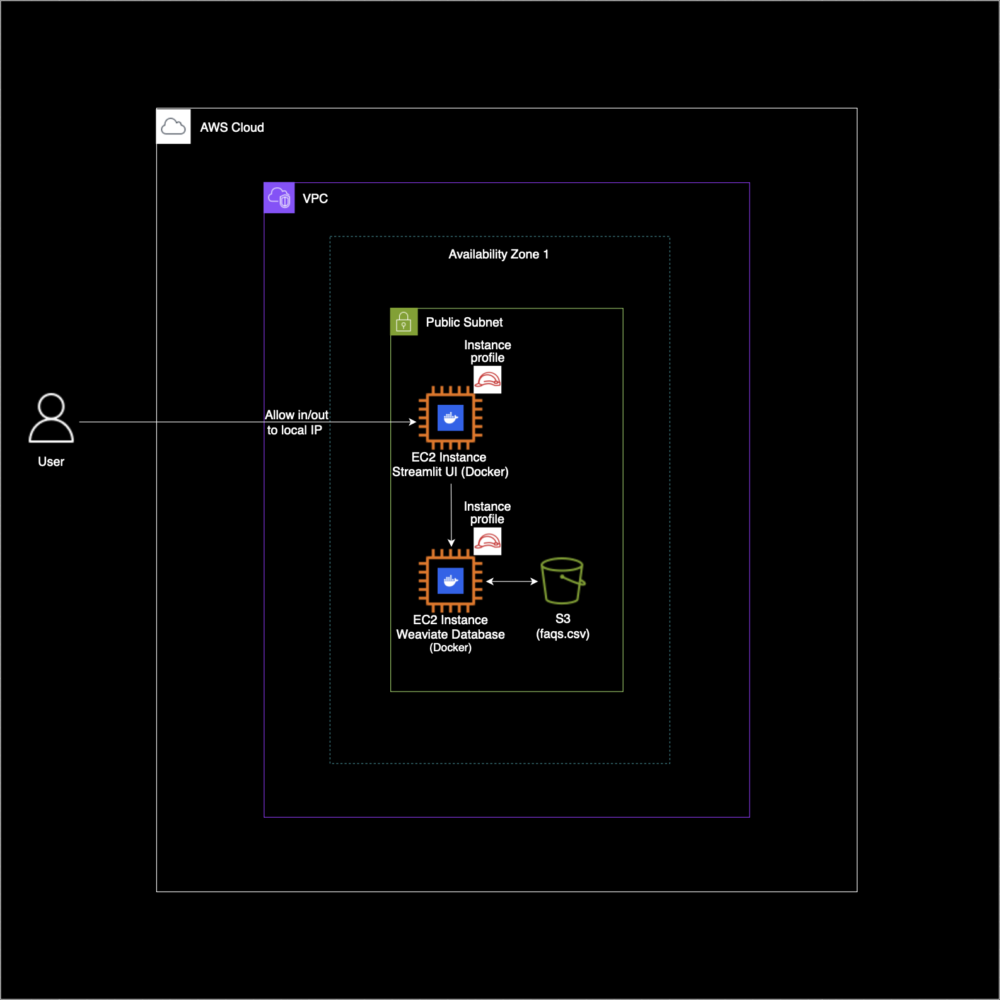

FAQ Semantic Search Platform Demo *(powered by Weaviate & OpenAI)*
============================

I made this FAQ Semantic Search as a proof-of-concept demonstrating how to build a scalable, AI-powered FAQ search system on AWS using Terraform, Weaviate, OpenAI, and Streamlit. For this POC, I based the search system on a FAQs regarding the AWS Cloud. This project showcases end-to-end infrastructure-as-code, real-time vector embeddings, containerization of services (Docker) and a polished front-end.

🔍 Project Overview
-------------------

-   **Problem**: Enable natural language search over a static CSV of FAQs.

-   **Solution**:

    1.  Terraform-provisioned AWS resources (EC2, S3, Security Groups, IAM roles).

    2.  Batched OpenAI embedding ingestion into Weaviate (vector database).

    3.  Hybrid (BM25 + vector) and pure-vector search via a Streamlit UI.

-  **Architecture Diagram**

    

🎯 Key Features
---------------

-   **Infrastructure as Code**:

    -   Single `terraform/` directory manages VPC, EC2, S3 bucket, IAM, and security groups.

    -   One-line `terraform apply` spins up a secure, public-facing Weaviate instance.

-   **Efficient Data Ingestion**:

    -   Batch embedding of questions into OpenAI's API to avoid rate/quota limits.

    -   Automatic upload of `faqs.csv` from S3 into Weaviate with precomputed vectors.

-   **Flexible Query Interface**:

    -   Streamlit app supporting both pure vector search (`nearText`) and hybrid search (`BM25 + vector`).

    -   Clear scoring metrics (distance vs. score) and graceful error handling.

-   **Low Cost / Free Tier**:

    -   EC2 `t3.micro` for Weaviate (free tier).

    -   Terraform-managed S3 for CSV storage.

    -   Free-tier OpenAI embeddings when trimmed CSV fits quota.

🚀 Tech Stack
-------------

-   **AWS**: EC2, S3, IAM

-   **Terraform**: Declarative infrastructure provisioning

-   **Weaviate**: Open-source vector database with OpenAI module

-   **OpenAI Embeddings**: `text-embedding-ada-002` (batched)

-   **Streamlit**: Lightweight Python UI framework

📋 Prerequisites
----------------

1.  **AWS CLI** configured with a profile that has EC2/S3/IAM permissions.

2.  **Terraform (v1.0+)** installed locally.

3.  **Python 3.8+** with `requests` and `streamlit` packages.

4.  **OpenAI API Key** with available embedding quota.

🧰 Usage & Demo Tips
--------------------

-   **Pure-Vector Search** (`nearText`):

    -   Enter a conversational query (e.g., "What is Amazon S3?").

    -   Returns semantically closest FAQs but may not always match exact keywords.

-   **Hybrid Search** (`BM25 + vector`):

    -   Ideal for precise, keyword-driven queries (e.g., "How do I launch an EC2 instance?").

    -   Combining BM25 reduces false positives and surfaces exact matches.
