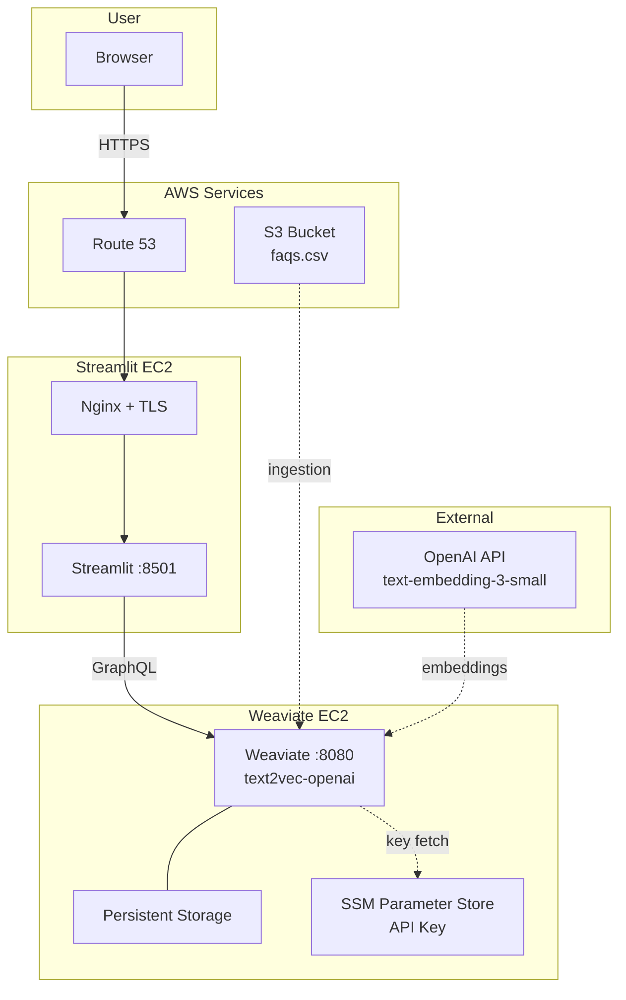

# FAQ Semantic Search Platform

## 1. Problem & Business Context

Static FAQ pages force users to scan dozens of entries manually. Keyword search fails when users phrase questions differently than the stored text. This project demonstrates how vector embeddings enable natural language retrieval — users ask questions in their own words and get semantically relevant answers regardless of exact keyword overlap.


## 2. Solution Overview

A two-EC2 deployment on AWS running Weaviate (vector database) and Streamlit (search UI). FAQ questions are embedded using OpenAI's `text-embedding-3-small` model and stored with precomputed vectors. Users query via a web interface that supports both pure vector search and hybrid (BM25 + vector) retrieval. Infrastructure is fully managed by Terraform.


## 3. Architecture Diagram


```mermaid
graph TB
    subgraph "User"
        Browser[Browser]
    end

    subgraph "Streamlit EC2"
        Nginx[Nginx + TLS]
        ST[Streamlit :8501]
    end

    subgraph "Weaviate EC2"
        WV[Weaviate :8080<br/>text2vec-openai]
        Data[Persistent Storage]
        SSM[SSM Parameter Store<br/>API Key]
    end

    subgraph "AWS Services"
        S3[S3 Bucket<br/>faqs.csv]
        R53[Route 53]
    end

    subgraph "External"
        OAI[OpenAI API<br/>text-embedding-3-small]
    end

    Browser -->|HTTPS| R53 --> Nginx --> ST
    ST -->|GraphQL| WV
    WV --- Data
    WV -.->|key fetch| SSM
    S3 -.->|ingestion| WV
    OAI -.->|embeddings| WV
```

Full architecture details: [docs/architecture.md](docs/architecture.md)


## 4. System Flow

**Query path (runtime):**
1. User submits question via Streamlit form
2. Streamlit sends GraphQL POST to Weaviate (nearText or hybrid)
3. Weaviate performs vector similarity search against FAQ class
4. Results returned with distance/score metrics, filtered by threshold
5. Streamlit renders matched Q&A pairs

**Ingestion path (one-time):**
1. `faqs.csv` pulled from S3 to EC2
2. `ingest-faqs-batched.py` sends questions to OpenAI embeddings API in batches of 50
3. Precomputed vectors inserted into Weaviate via REST API


## 5. Technology Stack & Rationale

| Technology | Role | Why |
|-----------|------|-----|
| Weaviate 1.26.1 | Vector database | Open-source, native hybrid search, OpenAI module integration |
| OpenAI text-embedding-3-small | Embedding model | Best cost/quality ratio for small datasets |
| Streamlit | Search UI | Rapid prototyping, built-in form handling, Python-native |
| Terraform (>=1.4, AWS ~>5.0) | Infrastructure as Code | Declarative, reproducible, state management |
| AWS EC2 (t3.medium) | Compute | Sufficient memory for Weaviate + Docker overhead |
| AWS S3 | Data storage | Versioned, encrypted, private bucket for FAQ source data |
| Nginx + Certbot | TLS termination | Free TLS, WebSocket support for Streamlit |
| Docker | Containerization | Consistent runtime, health checks, restart policies |
| SSM Parameter Store | Secret management | Free, IAM-scoped, avoids hardcoded keys |


## 6. Key Decisions & Tradeoffs

| Decision | Tradeoff | Rationale |
|----------|----------|-----------|
| Separate EC2 instances for Weaviate and Streamlit | Higher cost vs. security isolation | Weaviate port restricted to Streamlit SG only |
| SSM Parameter Store over Secrets Manager | No auto-rotation vs. zero cost | Single secret, manual rotation acceptable |
| Dynamic DNS over Elastic IP | Boot-time delay vs. no idle cost | Instance stopped when not demoing |
| Host bind mount over Docker volume | Less portable vs. survives container recreation | Data must persist across upgrades |

Full decision log: [docs/decisions.md](docs/decisions.md)


## 7. Challenges & Resolutions

| Challenge | Resolution |
|-----------|-----------|
| API key exposed in terraform.tfvars | Migrated to SSM Parameter Store, rotated key, removed variable from Terraform |
| Weaviate data lost on container recreation | Added host bind mount for persistent storage |
| Streamlit can't find Weaviate after instance restart | Tag-based IP discovery via `ec2:DescribeInstances` at boot |
| Two vectorizer paths causing confusion | Documented production (OpenAI) vs. local (transformers) modes explicitly |

Full lessons: [docs/lessons-learned.md](docs/lessons-learned.md)


## 8. Security Considerations

- OpenAI API key stored in SSM Parameter Store as SecureString, fetched at runtime only
- Weaviate port 8080 restricted to Streamlit security group (not publicly accessible)
- S3 bucket: all public access blocked, SSE-AES256, versioning enabled
- SSH restricted to single operator IP (not 0.0.0.0/0)
- SSM Session Manager available as SSH alternative (no key exposure)
- TLS enforced via Nginx with HTTP→HTTPS redirect
- IAM roles follow least-privilege: each EC2 gets only required permissions


## 9. Cost Considerations

| Resource | Estimated Monthly Cost | Notes |
|----------|----------------------|-------|
| EC2 t3.medium x2 | ~$60 (if running 24/7) | Stopped when not demoing; actual cost depends on uptime |
| EBS (8GB gp2 x2) | ~$1.60 | Charged even when stopped |
| S3 storage | <$0.01 | ~50KB of CSV/JSON data |
| OpenAI embeddings | One-time ~$0.001 | 30 questions × ~20 tokens each at $0.02/1M tokens |
| Data transfer | <$1 | Minimal for demo traffic |
| Route 53 hosted zone | $0.50 | Fixed monthly cost |
| SSM Parameter Store | $0 | Standard parameters are free |

**Cost optimization**: Instances are stopped when not actively demoing. Actual monthly cost during active demo periods is estimated at $5-15 depending on uptime hours.


[Estimates based on: AWS published pricing for us-east-1, OpenAI embedding pricing as of 2025]

## 10. Future Improvements

- TODO: Add CloudWatch alarms for Weaviate container health (measure: container restart count over 7 days)
- TODO: Implement automated ingestion pipeline triggered by S3 upload event (Lambda → SSM RunCommand)
- TODO: Add response latency instrumentation to Streamlit (measure: p50/p95 query time over 100 queries)
- TODO: Migrate to single-instance docker-compose for cost reduction (measure: monthly bill before/after)
- TODO: Add CI/CD pipeline for Streamlit image builds (GitHub Actions → ECR push → deploy)
- Remove `.DS_Store` from git history (`git filter-branch` or BFG)


## Local Development

Run the full stack locally without an OpenAI API key:

```bash
docker-compose up -d
python3 setup_weaviate.py
# App available at http://localhost:8501/faq-search-demo
```

This uses `text2vec-transformers` (MiniLM-L6-v2) instead of OpenAI embeddings.


## License

MIT License — see [LICENSE](LICENSE)
