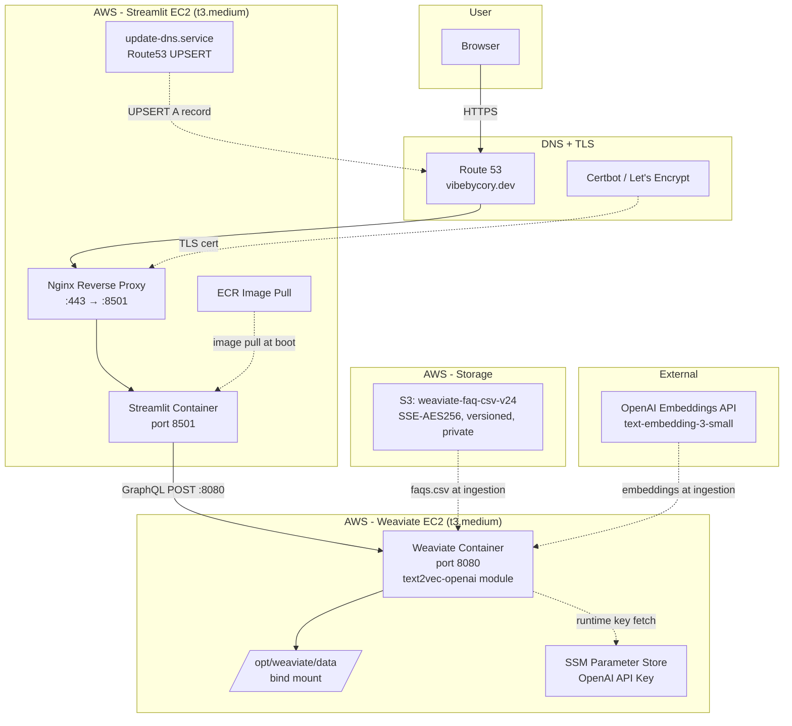

# Architecture

## System Overview

Two-EC2 deployment on AWS with Terraform-managed infrastructure, serving a semantic FAQ search application via Streamlit.

## Architecture Diagram



## Component Details

### Streamlit EC2
- Instance type: t3.medium
- AMI: Amazon Linux 2 (x86_64)
- Runs Streamlit container from ECR image
- Nginx reverse proxy with TLS termination (Certbot)
- Systemd services: `weaviate-faq.service`, `update-dns.service`
- Discovers Weaviate private IP via `ec2:DescribeInstances` at boot
- Security Group: 80/443/8501 public, SSH restricted to operator IP

### Weaviate EC2
- Instance type: t3.medium
- AMI: Amazon Linux 2 (x86_64)
- Runs Weaviate Docker container with `text2vec-openai` module
- Data persisted to host via bind mount (`/opt/weaviate/data`)
- OpenAI API key fetched from SSM Parameter Store at service start
- Security Group: 8080 from Streamlit SG only + operator IP, SSH restricted

### S3 Bucket
- Name: `weaviate-faq-csv-v24`
- Server-side encryption (AES-256)
- Versioning enabled
- All public access blocked
- Contains: `faqs.csv`, `faq_batch.json`, `faq_schema.json`

### IAM Roles
- `weaviate-ec2-role`: S3 read, SSM core, SSM parameter read (OpenAI key)
- `streamlit-ec2-role`: ECR read, SSM core, ec2:DescribeInstances, Route53 update, S3 read

### Networking
- Default VPC (172.31.0.0/16)
- Public subnet in us-east-1a
- Inter-instance communication via private IP on port 8080

## Data Flow

### Query Path (runtime)
```
User → HTTPS → Nginx → Streamlit (port 8501)
  → GraphQL POST → Weaviate (port 8080)
  → nearText or hybrid query against FAQ class
  → results returned with distance/score
```

### Ingestion Path (one-time setup)
```
faqs.csv (from S3 or local)
  → ingest-faqs-batched.py
  → OpenAI Embeddings API (text-embedding-3-small, batch size 50)
  → Weaviate /v1/objects (precomputed vectors)
```

## Deployment Modes

| Mode | Vectorizer | OpenAI Key Required | Use Case |
|------|-----------|-------------------|----------|
| EC2/Production | text2vec-openai | Yes (SSM Parameter Store) | Live demo at vibebycory.dev |
| Local/Docker Compose | text2vec-transformers (MiniLM-L6-v2) | No | Local development/testing |

## Source Files

- Terraform: `terraform/*.tf`
- Application: `app.py`, `ingest-faqs-batched.py`
- Schema: `faq_schema.json`
- Deployment: `deployment/`, `deploy-zero-touch.sh`
- Hardening: `harden-weaviate.sh`
